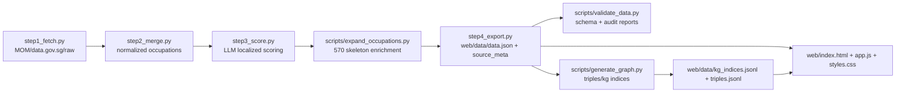

# AIScope SG Handover Manual

## 1) Project Vision

AIScope SG is a Singapore-focused public-interest AI Job Exposure Index.
It combines occupation-level data with localized policy constraints to estimate AI disruption risk.

Localization principles:
- PWM-covered roles have a capped risk envelope.
- Licensed sectors (SAL/MOH/MAS contexts) receive regulatory moat adjustments.
- Physical presence and multilingual frontline communication lower short-term replacement probability.

## 2) End-to-End Architecture

## 3) Annual Data Update Guide

When MOM releases new wage tables or SSOC updates:

1. Place new raw files into `data/raw/`.
2. Re-run expansion/export pipeline:
   - `python3 scripts/expand_occupations.py`
3. Rebuild graph assets:
   - `python3 scripts/generate_graph.py`
4. Run audit validation:
   - `python3 scripts/validate_data.py`
5. Review:
   - `docs/audit_report.json`
   - `docs/audit_summary.md`

If SSOC 2025 introduces new fields, update:
- `docs/data.schema.json`
- `scripts/expand_occupations.py` mapping logic
- `pipeline/step4_export.py` `source_meta` defaults

## 4) GraphRAG Maintenance

`scripts/generate_graph.py` produces:
- `triples.jsonl`: relation triples (`REQUIRES_SKILL`, `HAS_RISK`, `TRANSFER_PATH`, ...)
- `kg_indices.jsonl`: occupation summaries, vulnerability index, transition suggestions

To tune semantic search weighting:
- In `web/app.js`, adjust `getSemanticMatches()` score rules.
- In `prioritizeTransferPaths()`, change transfer priority order.
- In `generate_graph.py`, adjust transfer criteria and vulnerability formula.

## 5) Disaster Recovery and Rollback

If model APIs fail or external scoring is unavailable:

1. Restore baseline scoring using seeded fallback path (`scripts/seed_scores.py`).
2. Re-export front-end payload:
   - `python3 scripts/expand_occupations.py`
3. Re-run validation:
   - `python3 scripts/validate_data.py`
4. Deploy only after audit pass.

Rollback principle:
- Last known good deployment is the latest commit where:
  - schema validation passed
  - audit report has no errors
  - graph assets were regenerated and synchronized into `web/data/`

## 6) Operational Checklist

Before each release:
- [ ] `python3 scripts/expand_occupations.py`
- [ ] `python3 scripts/generate_graph.py`
- [ ] `python3 scripts/validate_data.py`
- [ ] Manual smoke test in subdirectory mode (`/test-dir/`)
- [ ] Verify deep link: `?job=<ssoc_code>`
- [ ] Verify methodology page and footer disclaimer links
